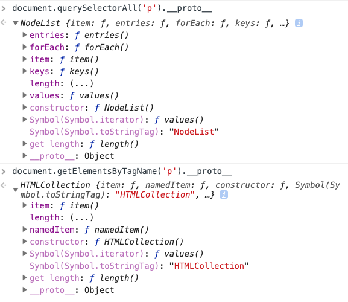

# 订阅邮件阅读笔记

## [Using the DOM like a Pro](https://itnext.io/using-the-dom-like-a-pro-163a6c552eba)

`querySelector` 和 `querySelectorAll` 模仿了jQuery `$` 函数。

`querySelectorAll` 返回的是静态的类数组 `NodeList`；不会随DOM的变化动态改变
 
 `getElementsByTagName`，`getElementsByClassName`返回的是动态的类数组 `HTMLCollection`，会随DOM的变化动态改变
 



## [npm 模块安装机制简介](http://www.ruanyifeng.com/blog/2016/01/npm-install.html)

<span id="npm-install">

Node模块的安装过程

 - 发出npm install命令
 - npm 向 registry 查询模块压缩包的网址
 - 下载压缩包，存放在~/.npm目录
 - 解压压缩包到当前项目的node_modules目录

## [npm install的实现原理](https://www.zhihu.com/question/66629910)

- `npm install` 回车
- 执行**工程中**的`preinstall`, 如果定义了的话
- 确定首层依赖模块
- 获取模块
- 模块扁平化   
  将可兼容的重复模块提升上层目录    
  解决 npm3 以前严格按照依赖树的结构进行安装造成模块冗余问题
  
- 安装模块   
  将获取到的模块写入node_modules，并执行**模块中**的生命周期函数（按照 preinstall、install、postinstall 的顺序）  

- 执行工程自身生命周期    
  当前 npm 工程如果定义了钩子此时会被执行（按照 install、postinstall、prepublish、prepare 的顺序）。
  最后一步是生成或更新版本描述文件，npm install 过程完成。

> [npx 使用教程](http://www.ruanyifeng.com/blog/2019/02/npx.html)

npm 从5.2版开始，增加了 npx 命令, 应该无需安装可以直接使用

   
安装：`npm install -g npx`     

### 使用npx
  `npx [package] [command]`

npx 的原理很简单，就是运行的时候，会到node_modules/.bin路径和环境变量$PATH里面，检查命令是否存在。如果不存在会将package下载到一个临时目录，使用以后再删除（避免全局安装）。

### 参数
- `--no-install`： 让 npx 强制使用本地模块，不下载远程模块
- `--ignore-existing`：  强制下载远程模块
- `-p`: 用于指定 npx 所要安装的模块, 对于需要安装多个模块的场景很有用    
  `$ npx -p lolcatjs -p cowsay [command]`

- `-c`: 
  - 可以将所有命令都用 npx 解释    
    如果 npx 安装多个模块，默认情况下，所执行的命令之中，只有第一个可执行项会使用 npx 安装的模块，后面的可执行项还是会交给 Shell 解释。
    `npx -p lolcatjs -p cowsay 'cowsay hello | lolcatjs'`报错，使用` npx -p lolcatjs -p cowsay -c 'cowsay hello | lolcatjs'`正常运行。
  - 将环境变量带入所要执行的命令。  
   举例来说，npm 提供当前项目的一些环境变量，可以用下面的命令查看。   
   `npm run env | grep npm_`  
   -c参数可以把这些 npm 的环境变量带入 npx 命令:  
   `npx -c 'echo "$npm_package_name"'`  

- 使用不同版本的 node   
`npx node@0.12.8 -v`
 某些场景下，这个方法用来切换 Node 版本，要比 nvm 那样的版本管理器方便一些。

npx 还可以执行 GitHub 上面的模块源码:
```
# 执行 Gist 代码
$ npx https://gist.github.com/zkat/4bc19503fe9e9309e2bfaa2c58074d32

# 执行仓库代码
$ npx github:piuccio/cowsay hello
```

## [](https://juejin.im/post/5ab3f77df265da2392364341)
npm5 增加了package-lock.json  

package-lock.json 的作用是锁定依赖安装结构，如果查看这个 json 的结构，会发现与 node_modules 目录的文件层级结构是一一对应的。
这个文件记录了 node_modules 里所有包的结构、层级和版本号甚至安装源，也就事实上提供了 “保存” node_modules 状态的能力。只要有这样一个 lock 文件，不管在那一台机器上执行 npm install 都会得到完全相同的 node_modules 结果。

查看 app 的直接依赖项，要通过 npm ls 命令指定 --depth 参数来查看：  
`npm ls --depth 1`

PS: 与本地依赖包不同，如果我们通过 npm install --global 全局安装包到全局目录时，得到的目录依然是“传统的”目录结构。而如果使用 npm 3 想要得到“传统”形式的本地 node_modules 目录，使用 `npm install --global-style` 命令即可。


## [curl 的用法指南](http://www.ruanyifeng.com/blog/2019/09/curl-reference.html)
